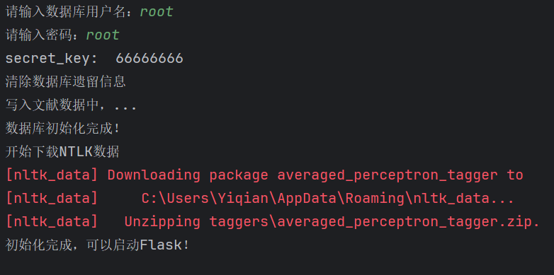

## 文献检索网站

### 1. 介绍
本项目为“山东大学（威海）数据科学与人工智能实验班”大二上学期大作业，目的是为Web of Science网站上的Remots Sensing of Environment期刊建立文献检索和可视化的网站，辅助研究人员进行文献回顾、主题分类并迅速找到研究空白点。

### 2. 项目架构
本网站基于python3.10开发，使用Flask架构、MySQL数据库，已成功部署在Ubuntu22.04轻型服务器上，多设备测试均成功，访问IP: http://122.51.7.220/（如果进不去就是服务器到期了）。

### 3. 部署教程

1.  先安装Mysql数据库，完成后新建一个`literaturesearch`数据库；
2.  安装python3.10，使用`pip install -r requirement.txt`安装依赖库；
3.  运行`init.py`设置数据库并下载nltk库所需的数据，根据提示输入数据库的用户名和密码。完成后数据库配置会保留在本地`db_setting.json`中，该文件在`database.py`中调用；
4.  由于ntlk开发团队位于国外，下载nltk数据可能需要很长时间（科学上网会快很多），如果无法下载可以将项目文件中的`averaged_perceptron_tagger.zip`文件复制进`nltk_data/taggers/`中（nltk_data文件夹在Windows平台一般位于`C:\Users\你的用户名\AppData\Roaming`下，Linux平台一般位于`/root`下，如果没有可以自己新建一个），再运行`init.py`；
    如果初始化成功，你应该完整地看到如下输出：
5.  完成以上操作后就可以使用了，注意flask app在该项目中使用`host = 0.0.0.0`运行，如不需要外网访问可以删除该参数；另外请注意运行`app.py`时使用命令行`python app.py`启动，不要使用flask启动，否则会读取不到数据库。

###  4. 网站开发

#### 4.1 技术栈

- 前端：HTML5, CSS, JavaScript, XHR
- 后端：Python, Flask框架, py-mysql
- 数据库：MySQL
- 主题模型：LDA, LSI
- 版本管理：Git, [Gitee仓库](https://gitee.com/Yiqian7a/literature-search-website)

#### 4.2 开发流程

1. 搭建后端flask框架，实现用户注册登录、获取首页等简单功能；
2. 设计数据库结构，设计表单；设计前端基本界面；
3. 串联数据库前后端，实现网页与对应后端操作的一一对应；
4. 完善前后端，优化网页结构，提升性能；
5. 测试，确保网站稳定性和用户体验。

###  5. 网站使用

#### 5.1 注册与登录

- 访问网站，如果未登入将跳转至登入界面。
- 点击“注册”按钮进行账号注册，已有账号的用户可以直接输入用户名和密码登录。

#### 5.2 首页

##### 5.2.1 概况

页面分为上下两块部分（红线上下），上面的内容不会改变，每一个页面都有，下面的内容根据不同页面会有所改变。当进入主页时，将随机推荐5篇文献，点击标题即可查看详细信息。在页面内跳转后，再点击首页即可返回首页，继续查看刚才查看的文献。

##### 5.2.2 搜索

在上面的搜索框输入时，会在数据库中搜索，展示作者、标题中包含关键词的内容并高亮。

搜索结果如下，点击其中文献将跳转至该文献的详细信息：

##### 5.2.3 用户信息

鼠标移至右上角，将弹出小框显示用户绑定的邮箱，可以点击其中的链接跳转至用户历史记录。

#### 5.3 历史记录

鼠标移至右上角，点击浏览历史，跳转至用户历史记录页面，可以查询到用户最近20条阅读记录。

#### 5.4 文献详情

点击需要查询的文献标题，将跳转至文献详情界面，

	首先可以查看所查阅文献的摘要，

	下面的表格依次展示了该文献的作者，页数，出版日期等具体信息，

最后，下面的主题分布图展示了该文献涉及的各主题关键词，各个关键词的比重与对应节点的大小成正比，每个小节点还可以进行拖动，避免遮挡问题。

#### 5.5 页尾

在页尾部分放置了网页源代码仓库的入口，随时方便查看和修改更新。

### 6. 项目贡献者

刘宇昊：项目负责人、全栈工程师、产品总监、测试、运维。负责项目优化、搭建Flask、部署服务器、配置数据库、搭建前端框架、搭建主题模型、编写代码、网页、说明文档等；

周洪田：负责前端网页设计和编写、项目测试等；

吴浏宇：参与搭建数据库、主题模型搭建；

陈梓博：参与服务器搭建、前端网页编写调试、说明文档编写，协助搭建主题模型；

王浚弛：参与网页设计；
